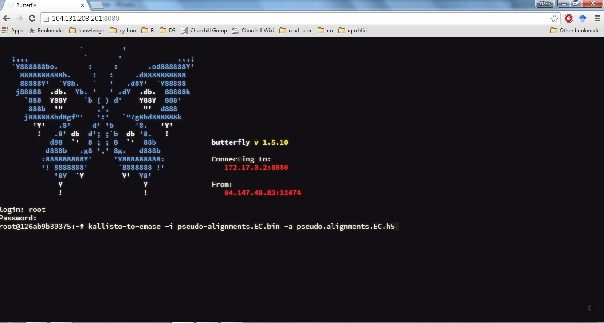

# Short Course on Systems Genetics 2015


This is a repository for [Short Course on Systems Genetics](https://www.jax.org/education-and-learning/education-calendar/2015/september/short-course-on-systems-genetics) (9/27 - 10/02/2015) at [The Jackson Laboratory](http://www.jax.org) that includes the following tutorials:

* __kallisto & EMASE__ (KB Choi & N Raghupathy): generate an index, pseudo-align reads and quantify the expression 
* __DESeq2__ (N Raghupathy) [[markdown]](https://github.com/churchill-lab/sysgen2015/blob/master/markdown/Differential_Expression.Rmd): detect differential expression between groups of RNASeq samples
* __DOQTL__ (D Gatti) [[markdown]](https://github.com/churchill-lab/sysgen2015/blob/master/markdown/DOQTL_workshop_2015.Rmd): kinship matrix, linkage and association mapping, eQTL viewer
* __Mediation analysis__ (S Munger, P Simecek & G Churchill):
* __D3 viewers__: [eQTL](http://cgd.jax.org/ShortCourse2015/eqtl), [pQTL](http://cgd.jax.org/ShortCourse2015/pqtl)

The participants use their web browsers to connect to customized [Docker](https://docs.docker.com/) containers hosted on [Digital Ocean](https://www.digitalocean.com/?refcode=673c97887267) virtual machines (see screen captures below).

 | 

Docker is a lightweight container virtualization platform. We created three Docker images for this course: [churchill/doqtl](https://github.com/churchill-lab/sysgen2015/tree/master/docker/doqtl) (RStudio, DOQTL, DESeq2), [churchill/asesuite](https://github.com/churchill-lab/sysgen2015/blob/master/docker/asesuite/Dockerfile) (kallisto, EMASE) and [churchill/webapp](https://github.com/churchill-lab/sysgen2015/blob/master/docker/webapp/Dockerfile) (eQTL/pQTL viewer).  You can run docker containers on your computer or in the cloud environments like AWS, Digital Ocean, Microsoft Azure or Google Cloud. [Dockerfiles](https://github.com/churchill-lab/sysgen2015/blob/master/docker/asesuite/Dockerfile) can also serve as a list of instructions how to install the software on your computer.

## How to start Digital Ocean droplet?

Here, I will give a description how our virtual machines have been created. You can either create a machine manually on Digital Ocean, SSH to it and start the docker containers. Or you can use [R/analogsea](https://github.com/sckott/analogsea) package to start a droplet from a command line. 

In both cases, first, create an account on [Digital Ocean](https://www.digitalocean.com/?refcode=673c97887267). You should get $10 promotional credit that currently corresponds to free 3.5 days of 8GB machine running expense.

### For beginners - create a virtual machine manually

* Log into your Digital Ocean account. Click on "Create Droplet" button. Choose any droplet hostname and select its size - 8GB memory, 4 CPU, $0.119/hour. 

   

   
Scroll down to "Select image", click on 'Applications' tab and select Docker. Click on "Create Droplet" button. Droplet now starts in 1-2 minutes. You should receive an email with a password.   
   


* Note down your droplet's IP.ADDRESS. SSH into your droplet (`ssh root@IP.ADDRESS`) and pull docker images
```{r}
  docker pull rocker/hadleyverse
  docker pull churchill/doqtl
  docker pull churchill/asesuite
  docker pull ipython/scipystack
  docker pull churchill/webapp
```
* Next, download the required datasets (~30 minutes)
```
   wget https://raw.githubusercontent.com/churchill-lab/sysgen2015/master/scripts/download_data_from_ftp.sh
   /bin/bash download_data_from_ftp.sh
   rm download_data_from_ftp.sh
```
* Finally, run docker containers. 
```{r}
  docker run -d -v /data:/data -p 8787:8787 -e USER=rstudio -e PASSWORD=sysgen churchill/doqtl
  docker run -dt -v /data:/data -p 43210:43210 -p 43211:43211  churchill/asesuite
  docker run -dt -v /data:/data -p 8888:8888 -p 8889:8889 churchill/webapp /usr/bin/start-app.sh
```

### For advanced users - create a virtual machine with R/analogsea package

* Install [R/analogsea](https://github.com/sckott/analogsea) package to your computer
* Create [Digital Ocean API key](https://cloud.digitalocean.com/settings/applications) and copy it to the second line of a script below
* Run [the script](https://github.com/simecek/AddictionCourse2015/blob/master/scripts/run_one_DO_machine.R)


### Access your virtual machine in the web browser

In your browser you can now access RStudio at http://IP.ADDRESS:8787 (user: rstudio, password: sysgen) and the terminal at http://IP.ADDRESS:43210 (user: root, password: sysgen). The eQTL and pQTL viewers are running at http://IP.ADDRESS:8888 and http://IP.ADDRESS:8889, respectively.

You are paying for your Digital Ocean machine as long as it is running. Do not forget to destroy it when you are done!
